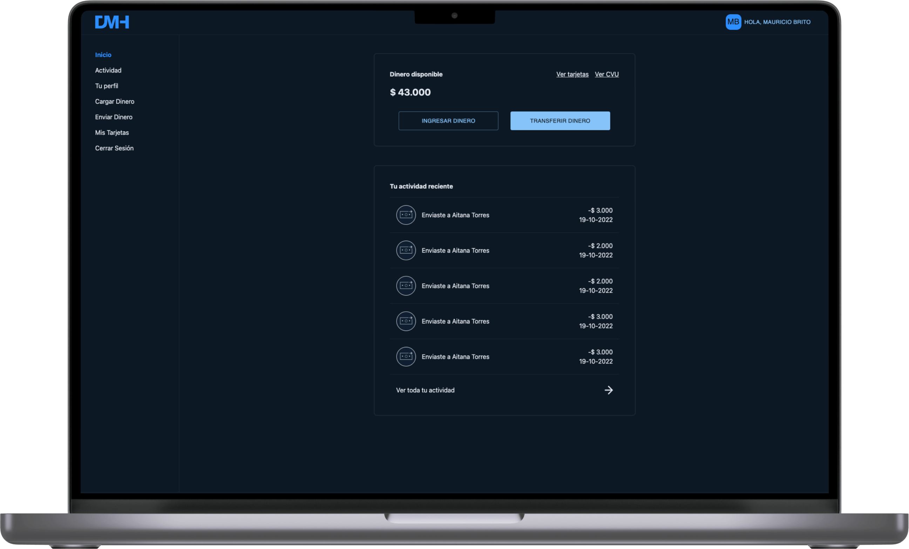

# Digital Money House Frontend
---

---

### Tabla de contenido

- [Descripción](#descripción)
- [Como instalar](#como-instalar)
- [Autor](#autor)

---

## Descripción

Temática: Billetera Digital (Digital Money House  )

#### Tecnologías

- React.js
- React Context API
- Typescript
- TailwindCSS
- Material UI
- React Credit Card
- React Router Dom V6
- JSON Server
- JSON Server Auth

[Volver arriba](#digital-money-house-frontend)

---

## Como Instalar

### Instalación

`npm install`

ó

`yarn install`

### Correr Backend fake para ver datos mock

`npm run fake-api`

ó

`yarn run fake-api`

### Correr Proyecto Frontend

`npm run start`

ó

`yarn run start`

### Debe tener un JWT válido para iniciar sesión

`La aplicacion le enviará a la sesión de inicio de sesión al momento de que expire el actual`

[Volver arriba](#digital-money-house-frontend)
